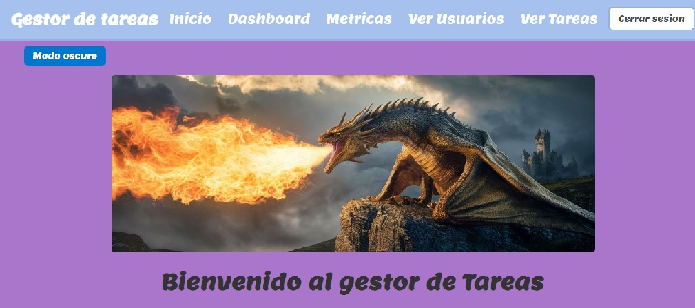
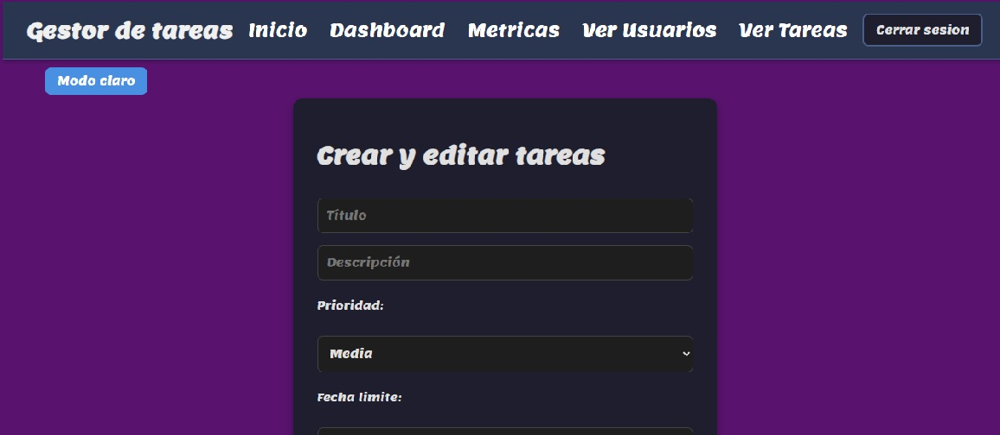
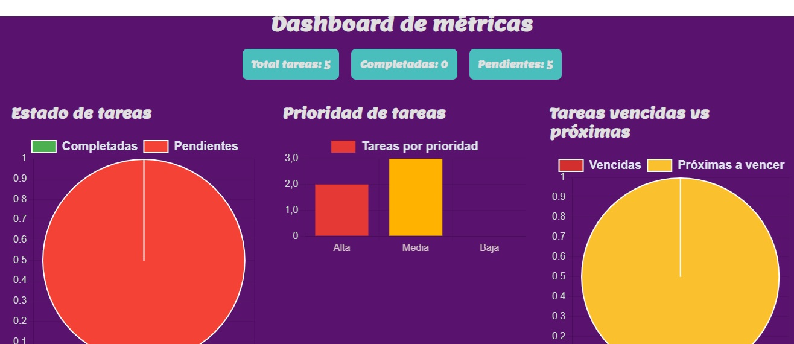
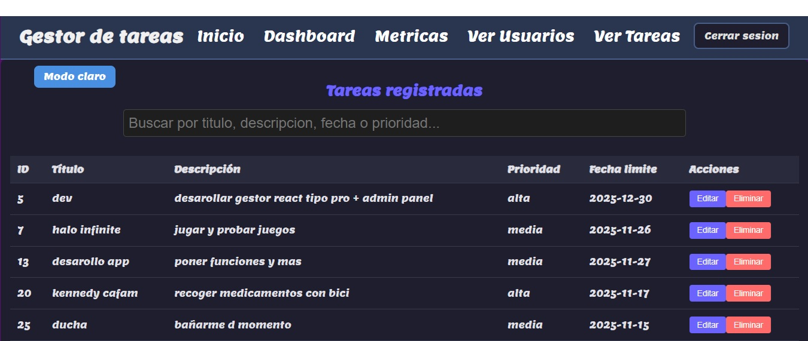
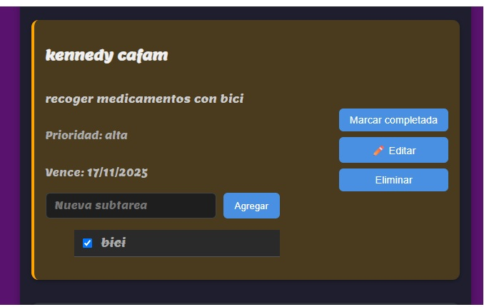

## Gestor de Tareas con Panel Admin

Aplicación fullstack desarrollada con Express (backend) y Vite + React (frontend). Permite gestionar tareas, subtareas y usuarios (modo claro y oscuro), con un panel administrativo que incluye métricas, gráficos y tabla estilizada.

## Tecnologías utilizadas

Backend: Node.js, Express, MySQL2

Frontend: Vite, React, Chart.js

Autenticación: JWT + middleware verificarToken y isAdmin, bcrypt

Estilos: CSS modular y responsive

Otros: dotenv, cors

## Instalación y ejecución

git clone https://github.com/donatelo666/App-tareas.git
cd APP-TAREAS

cd backend
npm install
npm run dev

cd frontend
npm install
npm run dev

## Variables de entorno

Backend

DB_HOST=localhost
DB_USER=root
DB_PASSWORD=tu_password
DB_NAME=gestor_tareas
JWT_SECRET=tu_secreto

Frontend

VITE_API_URL=http://localhost:3000/api

## Rutas principales

Autenticación

POST /api/auth/login
POST /api/auth/register

Usuario

GET /api/tareas
POST /api/tareas
PUT /api/tareas/:id
DELETE /api/tareas/:id

Admin

GET /api/admin/usuarios
PUT /api/admin/usuarios/:id
DELETE /api/admin/usuarios/:id
GET /api/admin/tareas
PUT /api/admin/tareas/:id
DELETE /api/admin/tareas/:id
GET /api/admin/tareas/metricas

## sistema modo oscuro y claro ejemplo

En `App.css` define:

```css
@import url("https://fonts.googleapis.com/css2?family=Lemon:wght@400;700&display=swap");

:root {
  --bg-color: #ffffff;
  --text-color: #222;
  --input-bg: #f5f5f5;
  --input-border: #ccc;
  --accent-color: #4caf50;
  --accent-gradient: linear-gradient(to right, #f0f0f0, #e8e8e8);
  --shadow: 0 2px 4px rgba(0, 0, 0, 0.1);


.dark-mode {
  --bg-color: #121212;
  --text-color: #e0e0e0;
  --input-bg: #1e1e1e;
  --input-border: #444;
  --accent-color: #81c784;
  --accent-gradient: linear-gradient(to right, #2a2a2a, #1e1e1e);
  --shadow: 0 2px 4px rgba(0, 0, 0, 0.4);


---
activa el cambio de modo en app.jsx

useEffect(() => {
  document.body.classList.toggle("dark-mode", isDarkMode);
}, [isDarkMode]);

---

en cada archivo css ejemplo , llama ambas variables del app.css
para el cambio de modo

.container {
  background-color: var(--card-bg);
  color: var(--text-color);
  box-shadow: var(--card-shadow);
}

```

## Funcionalidades del panel admin

Ver usuarios y tareas
Editar/eliminar usuarios y tareas
Métricas de tareas (totales, completadas, pendientes, vencidas, próximas)
Gráficos con Chart.js
Tabla estilizada y cards centrados

## capturas

# Home



# dashboard y crear



# Gráficos



# panel admin



# vista usuario


